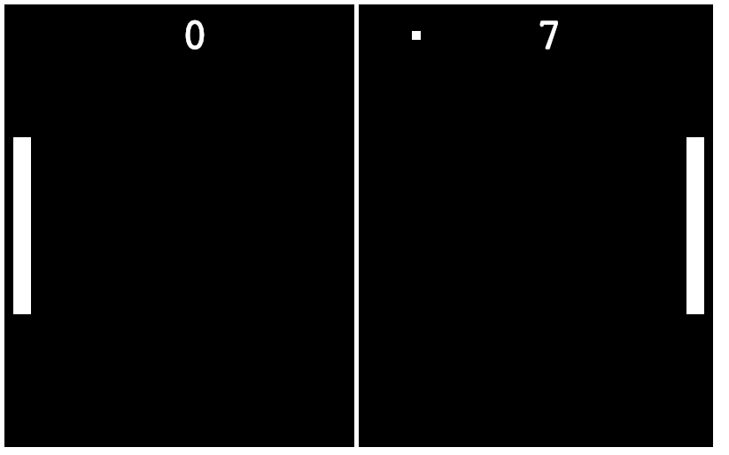

# Pong-game

Jogo Pong feito em javascript para orientar programadores iniciantes e mostrar o uso de algumas funções como canvas, eventListener e Math.Random.

Link para o post no Medium: [Criando o game Pong com JS em menos de 5 minutos](https://github.com/henriquearaujooficial/)

